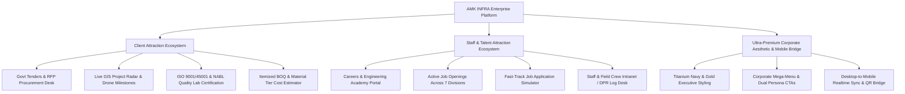

# Implementation Plan: Ultra-Professional Platform Upgrade for Clients & Staff

Elevate the **AMK INFRA Enterprise Platform** to world-class engineering contractor standards. The platform will be structured with dedicated magnets, portals, and high-trust capabilities designed specifically to **win high-value commercial/government/residential clients** and **recruit & empower top engineering talent & field staff**.

---

## 🎯 Strategic Objectives

---

## 👥 Persona-Driven Enhancements

### 1. For High-Value Clients (Govt Tenders, Real Estate Developers, Luxury Homeowners)
- **Govt PWD Class-I & Enterprise Tender Desk**: Pre-qualification criteria, BOQ submission, bank solvency rating, Class-I license verification, RFP document downloads.
- **Quality & Safety Assurance Hub**: ISO 9001:2015, ISO 45001 (Occupational Safety), ISO 14001 (Environmental), NABL-accredited concrete cube & TMT steel testing laboratory showcase.
- **Interactive Live Site Radar & Drone Imagery**: Visual tracker of landmark projects in Warangal Smart City, Kakatiya Textile Park, Outer Ring Road, and luxury villa enclaves.
- **Comprehensive BOQ Cost Estimator**: Material grade selectors (Fe-550D TMT, M30/M40 RMC Concrete, Italian Marble, Smart BMS Automation).

### 2. For Top Talent & Field Staff (Civil Engineers, MEP Leads, Supervisors, Operators)
- **Careers & Talent Portal (`CareersPage.jsx`)**:
  - Live openings across all 7 Corporate Divisions with salary brackets, perks, requirements, and responsibilities.
  - Interactive **Fast-Track Job Application Modal** with resume submission, experience calculator, and instant confirmation.
  - **"Why Engineers Choose AMK"**: Zero-LTI safety culture, continuous CPD training academy, health insurance, PF & performance bonuses, high-tech Leica/Drone equipment.
- **Staff & Field Crew Intranet (`StaffIntranetModal.jsx` / Staff Desk)**:
  - Daily Progress Report (DPR) submission simulator for site engineers.
  - Equipment & Fleet deployment schedule, daily toolbox talk safety checklist.

---

## 🛠️ Proposed Changes

### Backend & Data Layer (`server/`)

#### [MODIFY] [`server/data/store.js`](file:///c:/Users/MANOJ%20KUMAR%20RAVULA/Downloads/amk/server/data/store.js)
- Add seed data for **Job Openings** across the 7 divisions.
- Add seed data for **Government Pre-Qualifications & Tenders**.
- Add seed data for **Quality Lab NABL Test Metrics & Safety Milestones**.
- Add seed data for **Staff Daily Progress Reports (DPRs)**.

#### [MODIFY] [`server/index.js`](file:///c:/Users/MANOJ%20KUMAR%20RAVULA/Downloads/amk/server/index.js)
- Add `/api/careers/jobs` & `/api/careers/apply` endpoints.
- Add `/api/tenders/pre-qual` & `/api/tenders/submit-rfp` endpoints.
- Add `/api/staff/dpr` endpoint.

---

### Frontend Core & Navigation (`src/`)

#### [MODIFY] [`src/index.css`](file:///c:/Users/MANOJ%20KUMAR%20RAVULA/Downloads/amk/src/index.css)
- Implement titanium dark theme tokens, metallic gold borders, glassmorphism cards, pulsating live-site radar rings, and corporate engineering typography accents.

#### [MODIFY] [`src/api.js`](file:///c:/Users/MANOJ%20KUMAR%20RAVULA/Downloads/amk/src/api.js)
- Add API client methods: `getCareersJobs()`, `applyForJob()`, `submitTenderRfp()`, `submitStaffDpr()`, `getQualitySafetyData()`.

#### [MODIFY] [`src/context/AppContext.jsx`](file:///c:/Users/MANOJ%20KUMAR%20RAVULA/Downloads/amk/src/context/AppContext.jsx)
- Support new navigation routes: `careers`, `tenders`, `safety-quality`, and modals `staffPortalModalOpen`, `jobApplicationModalOpen`.

#### [MODIFY] [`src/components/common/Navbar.jsx`](file:///c:/Users/MANOJ%20KUMAR%20RAVULA/Downloads/amk/src/components/common/Navbar.jsx)
- Add structured mega-menus for **Divisions**, **Client Solutions (Tenders, Services, Estimator, Quality)**, and **Careers & Staff Portal**.
- Add dual quick-action buttons: **"Enterprise RFP"** and **"Join Our Crew / Careers"**.

#### [MODIFY] [`src/components/common/Footer.jsx`](file:///c:/Users/MANOJ%20KUMAR%20RAVULA/Downloads/amk/src/components/common/Footer.jsx)
- Add links for Corporate Governance, Safety & ISO Certifications, Careers & Staff Hub, Tender Submissions, and Direct Managing Director contact.

---

### New High-Value Pages & Modals (`src/components/`)

#### [NEW] [`src/components/careers/CareersPage.jsx`](file:///c:/Users/MANOJ%20KUMAR%20RAVULA/Downloads/amk/src/components/careers/CareersPage.jsx)
- Complete talent recruitment hub: Culture, employee benefits, training academy, live job listings with filter by division, and direct application form.

#### [NEW] [`src/components/careers/JobApplicationModal.jsx`](file:///c:/Users/MANOJ%20KUMAR%20RAVULA/Downloads/amk/src/components/careers/JobApplicationModal.jsx)
- Interactive resume & profile submission modal with division routing and immediate application tracking reference code.

#### [NEW] [`src/components/tenders/TendersPage.jsx`](file:///c:/Users/MANOJ%20KUMAR%20RAVULA/Downloads/amk/src/components/tenders/TendersPage.jsx)
- Corporate & Government Tender Desk: Class-I registration credentials, financial solvency certificate, machinery equipment capacity, and online RFP/BOQ bid submission form.

#### [NEW] [`src/components/safety/SafetyQualityPage.jsx`](file:///c:/Users/MANOJ%20KUMAR%20RAVULA/Downloads/amk/src/components/safety/SafetyQualityPage.jsx)
- NABL Quality Testing Lab (compressive strength, slump test, ultrasonic pulse velocity) & ISO 45001 Zero-LTI safety milestones.

#### [NEW] [`src/components/staff/StaffIntranetModal.jsx`](file:///c:/Users/MANOJ%20KUMAR%20RAVULA/Downloads/amk/src/components/staff/StaffIntranetModal.jsx)
- Field crew & site engineers daily DPR submission, machinery logbook, safety toolbox checklist, and field notifications.

---

### Homepage & Existing Components Polish

#### [MODIFY] [`src/components/home/HeroSection.jsx`](file:///c:/Users/MANOJ%20KUMAR%20RAVULA/Downloads/amk/src/components/home/HeroSection.jsx)
- Add dual-target CTAs (Client RFP vs Engineering Careers), live telemetry stats (Active Contracts, Zero-LTI Hours, Workforce on site, ISO 9001 certified).

#### [MODIFY] [`src/components/home/WhyChooseUsSection.jsx`](file:///c:/Users/MANOJ%20KUMAR%20RAVULA/Downloads/amk/src/components/home/WhyChooseUsSection.jsx)
- Expand to feature corporate governance, NABL certified material testing, mechanized machinery fleet, and transparent milestone billing.

#### [MODIFY] [`src/App.jsx`](file:///c:/Users/MANOJ%20KUMAR%20RAVULA/Downloads/amk/src/App.jsx)
- Route new pages (`careers`, `tenders`, `safety-quality`) and render `JobApplicationModal` and `StaffIntranetModal`.

---

## 🧪 Verification Plan

### Automated Build & Syntax Validation
- Run `cmd.exe /c "npm run build"` to guarantee 0 build or lint errors.

### Backend Endpoint Verification
- Test `/api/careers/jobs`, `/api/careers/apply`, `/api/tenders/submit-rfp`, and `/api/staff/dpr` via PowerShell/curl.

### Manual & Interactive Verification
- Verify navigation and mega-menu responsiveness on desktop and mobile.
- Test job application flow for prospective staff/engineers and confirm tracking ID generation.
- Test tender & RFP proposal submission flow for enterprise clients.
- Verify live synchronization between desktop web view and mobile companion simulator.
